# CA2 - Part1-Build Tools with Gradle

## Table of Contents

1. [Introduction](#Introduction)
2. [Getting Started](#Getting-Started)
3. [Implementing Changes](#Implementing-Changes)
   - [Create Folder CA2](#Create-Folder-CA2)
   - [Navigate to the Project Directory](#Navigate-to-the-Project-Directory)
   - [Clone the Repository](#Clone-the-Repository)
   - [Remove the .git folder](#Remove-the-git-folder)
   - [Open the project in IntelliJ IDEA](#Open-the-project-in-IntelliJ-IDEA)
   - [Read the README.md file](#Read-the-README.md-file)
   - [Open bash terminal and run the server](#Open-bash-terminal-and-run-the-server)
   - [Open two bash terminal and run the client](#Open-two-bash-terminal-and-run-the-client)
   - [Add new tasks to execute the server](#Add-new-tasks-to-execute-the-server)
   - [Add a test class and unit test](#Add-a-test-class-and-unit-test)
   - [Add a new task of type Copy to be used to make a backup](#Add-a-new-task-of-type-Copy-to-be-used-to-make-a-backup)
   - [Commit and push the changes](#Commit-and-push-the-changes)
   - [Add a new task of type Zip to be used to make a backup](#Add-a-new-task-of-type-Zip-to-be-used-to-make-a-backup)
   - [Commit and push the changes](#Commit-and-push-the-changes-1)
   - [Close issue assignment mark your repository with the tag "part1"](#Close-issue-assignment-mark-your-repository-with-the-tag-"part1")
   - [Conclusion](#Conclusion)

## Introduction
This project is a simple example of how to use Gradle to build a Java project. The project is a simple Java application that reads a file and prints its content to the console. The project is divided into two parts: Part1 and Part2. This document is for Part1.

## Getting Started
In Part1, we will create a simple Java application that reads a file and prints its content to the console. The application will have a main class and a utility class. The main class will read a file and call a method in the utility class to print the file's content to the console.
The first step is to clone this repository to your local machine as it will serve as the basis for the task. The rest of the assignment can be done by opening a bash terminal and running the following commands:

### Create Folder CA2
```javascript
mkdir -p CA2/Part1
```
### Navigate to the Project Directory
```javascript
cd CA2/Part1
```
### Clone the Repository
Clone the gradle project from the repository into the project directory.
```javascript
git clone https://bitbucket.org/pssmatos/gradle_basic_demo/
```
### Navigate to the Project Directory
```javascript
cd C:\Users\Public\Prof\DeVops-23-24-PSM-1231867\CA2\Part1\gradle_basic_demo
```
### Remove the .git folder
```javascript
Remove-Item -Path .\.git -Recurse -Force
git add .
git commit -m "Close #5 Create CA2 folder, creat and added folder Part1 to CA2 folder and clone gradle basic."
git push
```
### Open the project in IntelliJ IDEA
Open the project in IntelliJ IDEA and run the application to make sure it works.
```javascript
cd CA2/Part1/gradle_basic_demo
./gradlew build
```
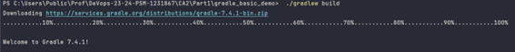
I need to reload recente version Gradle project to make sure it works.
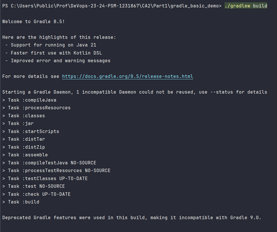
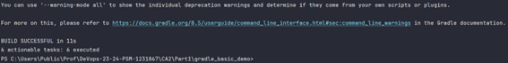

### Open the README.md file
Read the README.md file of the Gradle project to understand how the project works and what it does.
[README.md](https://bitbucket.org/pssmatos/gradle_basic_demo/src/master/README.md)

### Open bash terminal and run the server
Open a bash terminal and navigate to the project directory and execute the following command to run the server:
```javascript
$ java -cp build/libs/basic_demo-0.1.0.jar basic_demo.ChatServerApp 59001
```
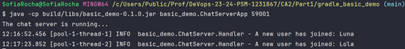

### Open two bash terminal and run the client
Open another bash terminal and navigate to the project directory and execute the following command to run the client:
```javascript
$ ./gradlew runClient
```
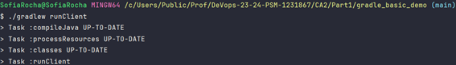
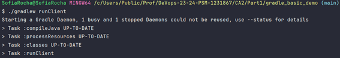
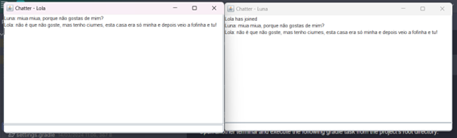

### Add new tasks to execute the server
In the build.gradle file, add a new task called runServer that will execute the server. The task should take a port number as an argument and pass it to the server when it is executed. The server should be executed in the background so that the task can return immediately.
```javascript
task runClient(type: JavaExec, dependsOn: classes) {
   group = "DevOps"
   description = "Launches a chat client that connects to a server on localhost:59001 "

   classpath = sourceSets.main.runtimeClasspath

   mainClass = 'basic_demo.ChatClientApp'

   args 'localhost', '59001'
}
```
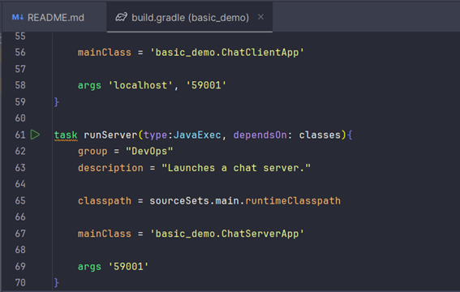
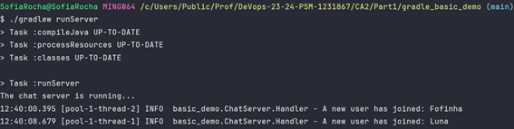
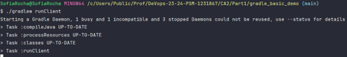
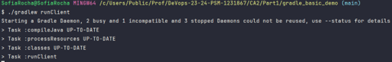
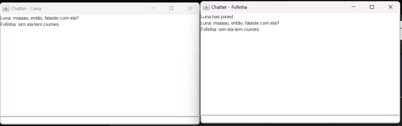

### Add a test class and unit test
Create a new class called AppTest in the src/test/java/basic_demo folder. The class should have
a method called testServer that tests the server by connecting to it and sending a message. The method
should assert that the server receives the message and responds with the expected response.
I need to added two lines in dependencies.
```javascript
package basic_demo;
new AppTest class
/*
* This Java source file was generated by the Gradle 'init' task.
*/
package basic_demo;

import org.junit.Test;
import static org.junit.Assert.*;

public class AppTest {
@Test public void testAppHasAGreeting() {
App classUnderTest = new App();
assertNotNull("app should have a greeting", classUnderTest.getGreeting());
}
}
```
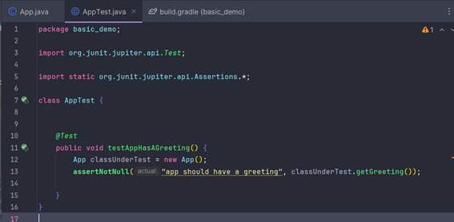
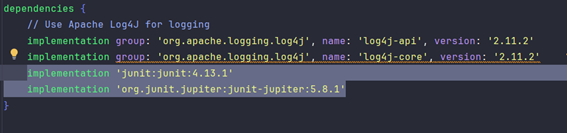

### Add a new task of type Copy to be used to make a backup
Add a new task called backup that copies the contents of the src/main/java/basic_demo folder to a backup folder. The task should create a zip file with the contents of the backup folder.
```javascript
task backup(type: Copy) {
    group = "DevOps"
    description = "Backs up the chat server log file."

    from 'src/main'
    into 'backup'
}
```
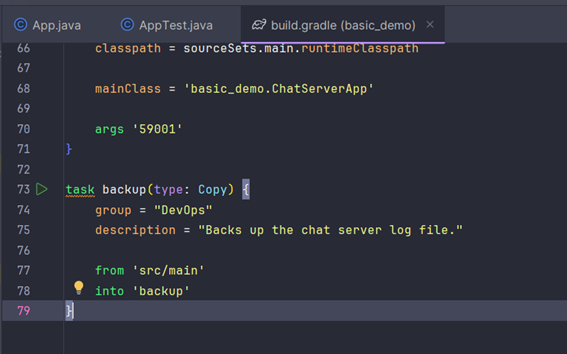
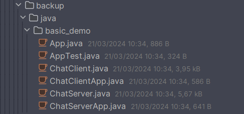

### Commit and push the changes
Commit the changes to the repository and push them to the remote repository.
```javascript
git add .
git commit -m "Close #8 Close #9 Added AppTest and create backup"
git push
```
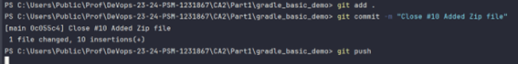

### Add a new task of type Zip to be used to make a backup
Add a new task called zipBackup of type Zip that creates a zip file with the contents of the backup folder.
```javascript
task zip(type: Zip, dependsOn: backup) {
   group = "DevOps"
   description = "Zips the chat server log file."

   from 'src/main'
   archiveFileName = 'src.zip'
   destinationDirectory = file('build')
}
```
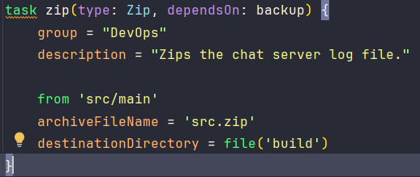

### Commit and push the changes
Commit the changes to the repository and push them to the remote repository.
```javascript
git add .
git commit -m "Close #10 Added Zip file"
git push
```
### Close issue assignment mark your repository with the tag "part1".
At the end of the part 1 of this assignment mark your repository with the tag
ca2-part1.
```javascript
git commit close #6 Close #12 "ca2-part1"
git tag ca2- part1
git push origin part1
```

### Conclusion
In this document, we have created a simple Java application that reads a file and prints its content to the console. 
We have used Gradle to build the project and added new tasks to execute the server, run unit tests, make a backup, and create a zip file. 
We have also committed the changes to the repository and pushed them to the remote repository, using issues to track the changes made to the project.


