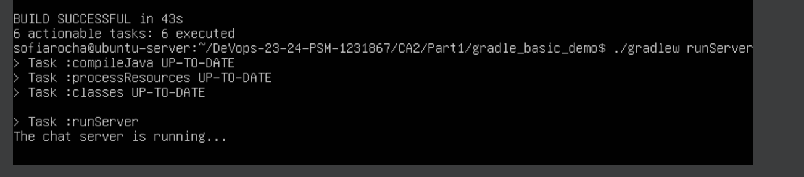

# CA3 - Part 1

## Table of Contents
1. [Introduction](#introduction)
2. [Virtual Machine Setup](#virtual-machine-setup)
3. [Repository Cloning](#repository-cloning)
4. [Building and Running the Projects](#building-and-running-the-projects)
5. [Issues Encountered](#issues-encountered)
6. [Accessing Web Projects](#accessing-web-projects)
7. [Running the Chat Application](#running-the-chat-application)
8. [Process Documentation](#process-documentation)
9. [Repository Tagging](#repository-tagging)
10. [Conclusion](#conclusion)

## Introduction
This document describes the process of setting up a Virtual Machine (VM) using VirtualBox/UTM with Ubuntu, and running the Spring Boot tutorial basic and gradle_basic_demo projects within the VM.

## Virtual Machine Setup
Created a new VM using VirtualBox/UTM with Ubuntu. Allocated sufficient resources (RAM, storage, etc.) for the VM.

## Repository Cloning
Cloned the repository using the command `git clone https://github.com/ASofiaRocha/DeVops-23-24-PSM-1231867.git`.

## Building and Running the Projects
Installed the necessary dependencies in virtual box (Git, JDK, Maven, Gradle) using the commands:

### Update and upgrade the system:
```bash
sudo apt update
sudu apt upgrade
```

### Install Git:
```bash
sudo apt install git
```

### Install JDK:
```bash
sudo apt install openjdk-11-jdk
```

### Install Maven:
```bash
sudo apt install maven
```

### Install Gradle:
```bash
wget https://services.gradle.org/distributions/gradle-8.6-bin.zip
sudo mkdir /opt/gradle
sudo unzip -d /opt/gradle gradle-8.6-bin.zip
echo "export GRADLE_HOME=/opt/gradle/gradle-8.6" >> ~/.bashrc
echo "export PATH=$PATH:$GRADLE_HOME/bin" >> ~/.bashrc
source ~/.bashrc
```

### Verify the installation:
```bash
git --version
java -version
mvn -version
gradle -version
```


### Giving permissions to the project:
```bash
chmod +x gradlew
chmod +x mvnw
```

### Navigated to the project directory and used the appropriate command to build and run the project:  
```bash
cd DeVops-23-24-PSM-1231867
```

### For the Spring Boot tutorial basic project:
#### CA1 - Part 1
```bash
cd DeVops-23-24-PSM-1231867/CA1/basic
./mvnw clean install
./mvnw spring-boot:run
```
"

### Open a web browser and navigate to `http://localhost:8080/` to view the project.
#### To know the IP address of the VM:
```bash
ip addr
```
http://192.168.56.5:8080/


### For the gradle_basic_demo project:
#### CA2 - Part 1
```bash
cd DeVops-23-24-PSM-1231867/CA2/Part1/gradle_basic_demo
./gradlew build
./gradlew runServer
gradle runClient --args="192.168.56.5 59001"
```


#### CA2 - Part 2
```bash
cd DeVops-23-24-PSM-1231867/CA2/Part2/react-and-spring-data-rest
./gradlew build
./gradlew bootRun
```


### Open a web browser and navigate to `http://localhost:8080/` to view the project.
http://192.168.56.5:8080/

## Issues Encountered
My version of VirtualBox was old, so I had to update it, after blue screen of death, the computer shut down and I had to restart the VM.
I also had to install the necessary dependencies to run the projects. 


## Accessing Web Projects
The web projects can be accessed by navigating to `http://localhost:8080/` in a web browser.

## Running the Chat Application
The chat application can be run by following the instructions in the [Building and Running the Projects](#building-and-running-the-projects) section.

## Process Documentation
The process of setting up the VM, cloning the repository, building and running the projects, and accessing the web projects was documented in this README file.

## Repository Tagging and Commit History
The repository was tagged at the following points:
- After cloning the repository
- After building and running the Spring Boot tutorial basic project
- After building and running the gradle_basic_demo project
- After running the chat application
```bash
git add .
git commit -m "README CA3 - Part 1"
git push origin main
git tag -a ca3-part1 -m "Complete CA3 Part 1 Close #22"
git push origin --tags
```
## Conclusion
The process of setting up the VM, cloning the repository, building and running the projects, and accessing the web projects was successful. 
The chat application was also run successfully. The repository was tagged at the appropriate points and the commit history was updated accordingly.
```
