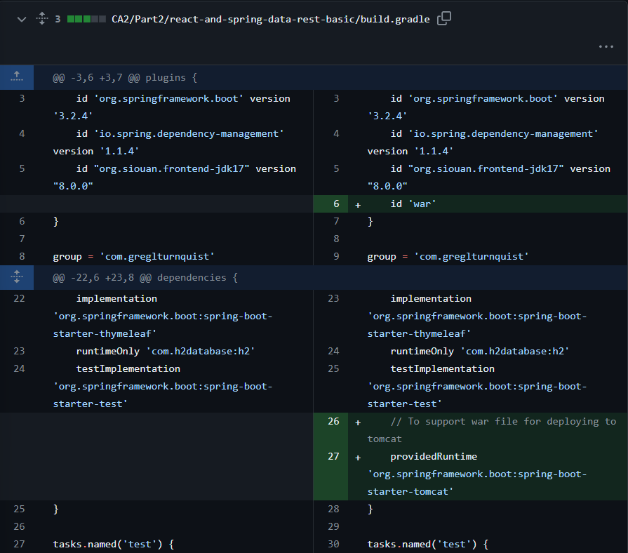

# CA3 - Part 2

## Table of Contents

1. [Introduction](#introduction)
2. [Virtual Environment Setup](#virtual-environment-setup)
3. [Updating the Vagrantfile](#updating-the-vagrantfile)
4. [Updating the Spring Application](#updating-the-spring-application)
5. [Running the Application](#running-the-application)
6. [Issues Encountered](#issues-encountered)
7. [Repository Tagging](#repository-tagging)
8. [Conclusion](#conclusion)

## Introduction

This document describes the process of setting up a virtual environment using Vagrant to execute the Spring Boot
tutorial basic application (Gradle version) developed in CA2, Part 2.

## Virtual Environment Setup

The initial solution provided at `https://bitbucket.org/pssmatos/vagrant-multi-spring-tut-demo/` was used as a starting
point.
This solution uses a `Vagrantfile` to create and provision two VMs:

- `web`: This VM is used to run Tomcat and the Spring Boot basic application.
- `db`: This VM is used to execute the H2 server database.

## Updating the Vagrantfile

The `Vagrantfile` was copied to the repository (inside the folder for this assignment) and updated to use the Gradle
version of the Spring application.
The changes included updating the paths to the project and modifying the provisioning scripts to build and run the
Gradle project.


## Updating the Spring Application

The Spring application was updated to use the H2 server in the `db` VM.
This involved changing the database URL in the `application.properties` file to point to the H2 server running on
the `db` VM.
The necessary changes were replicated from the example provided at `https://bitbucket.org/pssmatos/tut-basic-gradle`.





## Running the Application

After setting up the virtual environment and updating the Spring application, the application was run using the
following steps:

1. Start the VMs using the command `vagrant up`.
2. SSH into the `web` VM using the command `vagrant ssh web`.
3. Navigate to the project directory and run the application.


The application can be accessed by navigating to `http://localhost:8080/` in a web browser or accessing the web links
provided in professor repository.


Open the H2 console to navigating in a web browser and verify the database connection.


## Issues Encountered

During the process of setting up the virtual environment and running the application, I encountered an issue related to
insufficient memory space on the initial VM.
This issue prevented the successful execution of the Spring Boot application.
To resolve this, I had to create a new VM with more allocated memory.
This was an important step as it ensured the smooth operation of the application.

## Alternative Solution

It´s necessary to have the vagrant-vmware-workstation plugin installed. To install it, run the following command:

```bash
vagrant plugin install vagrant-vmware-workstation
```

```bash
# See: https://manski.net/2016/09/vagrant-multi-machine-tutorial/
# for information about machine names on private network

Vagrant.configure("2") do |config|
  config.vm.box = "ubuntu/bionic64"
  config.vm.provider "vmware_workstation"

  # Common provision for both VMs
  config.vm.provision "shell", inline: <<-SHELL
    sudo apt-get update -y
    sudo apt-get install -y iputils-ping avahi-daemon libnss-mdns unzip \
        openjdk-17-jdk-headless
  SHELL

  # Configurations specific to the database VM
  config.vm.define "db" do |db|
    db.vm.network "private_network", ip: "192.168.56.11"
    db.vm.hostname = "db"

    # We want to access H2 console from the host using port 8082
    db.vm.network "forwarded_port", guest: 8082, host: 8082
    db.vm.network "forwarded_port", guest: 9092, host: 9092

    # Download H2
    db.vm.provision "shell", inline: <<-SHELL
      wget https://repo1.maven.org/maven2/com/h2database/h2/1.4.200/h2-1.4.200.jar
    SHELL

    # Start H2 server
    db.vm.provision "shell", :run => 'always', inline: <<-SHELL
      java -cp ./h2*.jar org.h2.tools.Server -web -webAllowOthers -tcp -tcpAllowOthers -ifNotExists > ~/out.txt &
    SHELL
  end

  # Configurations specific to the webserver VM
  config.vm.define "web" do |web|
    web.vm.network "private_network", ip: "192.168.56.10"
    web.vm.hostname = "web"

    # Set more RAM memory for this VM
    web.vm.provider "vmware_workstation" do |v|
      v.vmx["memsize"] = "1024"
    end

    # We want to access tomcat from the host using port 8080
    web.vm.network "forwarded_port", guest: 8080, host: 8080

    web.vm.provision "shell", inline: <<-SHELL, privileged: false
      sudo apt install -y tomcat9 tomcat9-admin

      # If you want to access Tomcat admin web page do the following:
      # Edit /etc/tomcat9/tomcat-users.xml
      # uncomment tomcat-users and add manager-gui to tomcat user

      # Clone repository and build project
      git clone https://github.com/ASofiaRocha/DeVops-23-24-PSM-1231867.git
      cd DeVops-23-24-PSM-1231867/CA2/Part2/react-and-spring-data-rest-basic
      chmod u+x gradlew
      ./gradlew clean build
      ./gradlew bootRun
    SHELL
  end
end
```

### Comparing this `Vagrantfile` for VMWare with the original `Vagrantfile` for VirtualBox:

| Aspect             | VirtualBox                                     | VMWare                                          |
|--------------------|------------------------------------------------|-------------------------------------------------|
| ------------------ | ---------------------------------------------- | ----------------------------------------------- |
| License            | Free for personal and evaluation use.          | VMWare Workstation Pro is paid.                 |
| Aspect             | VirtualBox                                     | VMWare                                          |
| Performance        | Less efficient for heavier operating systems.  | More efficient in terms of performance.         |
| Compatibility      | Supports a large number of operating systems.  | Supports fewer operating systems.               |
| Features           | Fewer features.                                | More features, better hardware simulation.      |
| Ease of Use        | Simpler and easier to use interface.           | More complex interface with more options.       |
| Compatibility      | Supports a large number of operating systems.  | Supports fewer operating systems.               |
| Vagrant Support    | Fully supported, default provider.             | Supported, requires additional plugin/license.  |


## Repository Tagging

After completing Part 2 of the assignment and commit readme, the repository was tagged with the tag `ca3-part2` using
the command:

```bash
git add .
git commit -m "README CA3 - Part 2 Close #24"
git push origin main
git tag -a ca3-part2 -m "Complete CA3 Part 2"
git push origin --tags
```


## Conclusion

This document described the process of setting up a virtual environment using Vagrant to execute the Spring Boot
tutorial basic application (Gradle version) developed in CA2, Part 2.
The steps included updating the `Vagrantfile` to use the Gradle version of the Spring application, modifying the Spring
application to use the H2 server in the `db` VM, and running the application in the virtual environment.
Comparing the `Vagrantfile` for VirtualBox with the `Vagrantfile` for VMWare, it is clear that VMWare offers better performance and more features, but it is a paid software.
Overall, the process was successful, and the application was run without any major issues.


